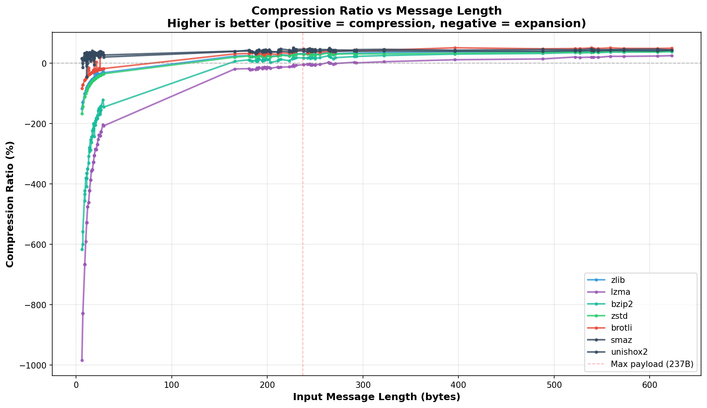
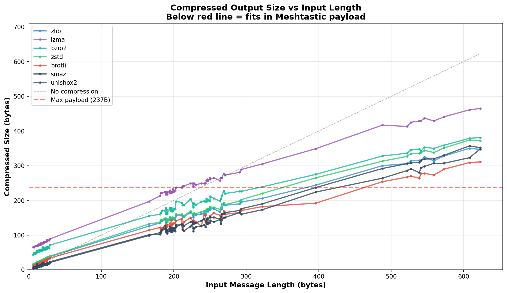

# MESHTASTIC TEXT COMPRESSION BENCHMARK

Maximum Meshtastic payload: **237 bytes** (compressed)

---


## AVERAGE COMPRESSION PERFORMANCE BY MESSAGE LENGTH

| Length Range | Count | zlib | lzma | bzip2 | zstd | brotli | smaz | unishox2 |
|--------------|-------|----------:|----------:|----------:|----------:|----------:|----------:|----------:|
| Very Short (0-30 bytes) | 61 | -57.5% (100% fit) | -380.9% (100% fit) | -257.9% (100% fit) | -65.0% (100% fit) | -30.0% (100% fit) |  21.9% (100% fit) |  29.2% (100% fit) | 
| Medium (101-200 bytes) | 19 |  25.4% (100% fit) | -16.2% (100% fit) |  11.0% (100% fit) |  23.7% (100% fit) |  33.6% (100% fit) |  41.2% (100% fit) |  39.7% (100% fit) | 
| Long (201-300 bytes) | 28 |  30.9% (100% fit) |  -5.6% (11% fit) |  17.1% (100% fit) |  28.8% (100% fit) |  39.0% (100% fit) |  45.4% (100% fit) |  40.3% (100% fit) | 
| Very Long (301-500 bytes) | 3 |  37.6% (33% fit) |  10.6% (0% fit) |  29.7% (0% fit) |  33.5% (33% fit) |  47.6% (67% fit) |  45.2% (67% fit) |  40.4% (67% fit) | 
| Extremely Long (501+ bytes) | 9 |  42.1% (0% fit) |  21.9% (0% fit) |  36.6% (0% fit) |  38.1% (0% fit) |  49.6% (0% fit) |  45.7% (0% fit) |  42.1% (0% fit) | 

*Note: Negative percentages indicate expansion (compressed size larger than original)*


## COMPRESSION RATIO PLOT




## COMPRESSED SIZE PLOT




## PAYLOAD FIT VISUALIZATION

```
Maximum Message Length That Fits in 237-byte Payload

Algorithm    0    100   200   300   400   500
             │     │     │     │     │     │
Brotli       ├─────┴─────┴─────┴─────┤
             │ ████████████████████████░░░░ 396 bytes
             │
Zlib         ├─────┴─────┴─────┤
             │ ████████████████░░░░░░░░░░░░ 322 bytes
             │
Zstd         ├─────┴─────┴─────┤
             │ ████████████████░░░░░░░░░░░░ 322 bytes
             │
Bzip2        ├─────┴─────┤
             │ █████████████░░░░░░░░░░░░░░░ 293 bytes
             │
Snappy       ├─────┴────┤
             │ ███████████░░░░░░░░░░░░░░░░░ 238 bytes
             │
LZ4          ├─────┴───┤
             │ ██████████░░░░░░░░░░░░░░░░░░ 214 bytes
             │
LZMA         ├─────┴───┤
             │ ██████████░░░░░░░░░░░░░░░░░░ 211 bytes

█ = Message fits in payload
░ = Message too large
```


## MAXIMUM UNCOMPRESSED MESSAGE LENGTH

*(that fits in 237 byte Meshtastic payload)*

| Rank | Algorithm | Max Length | Example |
|------|-----------|------------|---------|
| 🏆 1 | **brotli** | 396 bytes | I've been working with the technical team to devel... |
| 2 | **smaz** | 396 bytes | I've been working with the technical team to devel... |
| 3 | **unishox2** | 396 bytes | I've been working with the technical team to devel... |
| 4 | **zlib** | 322 bytes | During our extended observation period we noticed ... |
| 5 | **zstd** | 322 bytes | During our extended observation period we noticed ... |
| 6 | **bzip2** | 293 bytes | The comprehensive field testing we conducted last ... |
| 7 | **lzma** | 211 bytes | That makes sense given all the WiFi networks, cell... |

**🏆 WINNER: BROTLI** - Allows up to **396 bytes** uncompressed text


## COMPRESSION RESULTS - ALL MESSAGES (grouped by length)

| Len | Message | zlib | lzma | bzip2 | zstd | brotli | smaz | unishox2 | Best |
|-----|---------|---------:|---------:|---------:|---------:|---------:|---------:|---------:|------|
| 6 | Coming | 15✓ (-150.0%) | 65✓ (-983.3%) | 43✓ (-616.7%) | 16✓ (-166.7%) | 11✓ (-83.3%) | 5✓ ( 16.7%) | 5✓ ( 16.7%) | **smaz** |
| 7 | I won't | 16✓ (-128.6%) | 65✓ (-828.6%) | 49✓ (-600.0%) | 17✓ (-142.9%) | 12✓ (-71.4%) | 8✓ (-14.3%) | 6✓ ( 14.3%) | **unishox2** |
| 7 | Perfect | 16✓ (-128.6%) | 65✓ (-828.6%) | 46✓ (-557.1%) | 17✓ (-142.9%) | 12✓ (-71.4%) | 7✓ (  0.0%) | 6✓ ( 14.3%) | **unishox2** |
| 9 | Excellent | 18✓ (-100.0%) | 69✓ (-666.7%) | 47✓ (-422.2%) | 19✓ (-111.1%) | 14✓ (-55.6%) | 7✓ ( 22.2%) | 6✓ ( 33.3%) | **unishox2** |
| 9 | Good idea | 18✓ (-100.0%) | 69✓ (-666.7%) | 48✓ (-433.3%) | 19✓ (-111.1%) | 14✓ (-55.6%) | 8✓ ( 11.1%) | 6✓ ( 33.3%) | **unishox2** |
| 9 | I see you | 18✓ (-100.0%) | 69✓ (-666.7%) | 50✓ (-455.6%) | 19✓ (-111.1%) | 14✓ (-55.6%) | 8✓ ( 11.1%) | 6✓ ( 33.3%) | **unishox2** |
| 10 | Impressive | 19✓ (-90.0%) | 69✓ (-590.0%) | 48✓ (-380.0%) | 20✓ (-100.0%) | 15✓ (-50.0%) | 9✓ ( 10.0%) | 7✓ ( 30.0%) | **unishox2** |
| 11 | Around 3pm? | 20✓ (-81.8%) | 69✓ (-527.3%) | 56✓ (-409.1%) | 21✓ (-90.9%) | 16✓ (-45.5%) | 12✓ ( -9.1%) | 10✓ (  9.1%) | **unishox2** |
| 11 | None at all | 20✓ (-81.8%) | 69✓ (-527.3%) | 51✓ (-363.6%) | 21✓ (-90.9%) | 16✓ (-45.5%) | 7✓ ( 36.4%) | 7✓ ( 36.4%) | **smaz** |
| 11 | There we go | 20✓ (-81.8%) | 69✓ (-527.3%) | 51✓ (-363.6%) | 21✓ (-90.9%) | 16✓ (-45.5%) | 7✓ ( 36.4%) | 7✓ ( 36.4%) | **smaz** |
| 11 | Try 915 MHz | 20✓ (-81.8%) | 69✓ (-527.3%) | 53✓ (-381.8%) | 21✓ (-90.9%) | 16✓ (-45.5%) | 16✓ (-45.5%) | 11✓ (  0.0%) | **unishox2** |
| 11 | Which gear? | 20✓ (-81.8%) | 69✓ (-527.3%) | 53✓ (-381.8%) | 21✓ (-90.9%) | 16✓ (-45.5%) | 9✓ ( 18.2%) | 9✓ ( 18.2%) | **smaz** |
| 12 | How far now? | 21✓ (-75.0%) | 69✓ (-475.0%) | 54✓ (-350.0%) | 22✓ (-83.3%) | 17✓ (-41.7%) | 12✓ (  0.0%) | 10✓ ( 16.7%) | **unishox2** |
| 12 | Still at 80% | 21✓ (-75.0%) | 69✓ (-475.0%) | 54✓ (-350.0%) | 22✓ (-83.3%) | 17✓ (-41.7%) | 12✓ (  0.0%) | 9✓ ( 25.0%) | **unishox2** |
| 13 | About 3 miles | 22✓ (-69.2%) | 73✓ (-461.5%) | 56✓ (-330.8%) | 23✓ (-76.9%) | 15✓ (-15.4%) | 11✓ ( 15.4%) | 10✓ ( 23.1%) | **unishox2** |
| 13 | Still nothing | 22✓ (-69.2%) | 73✓ (-461.5%) | 53✓ (-307.7%) | 23✓ (-76.9%) | 16✓ (-23.1%) | 9✓ ( 30.8%) | 9✓ ( 30.8%) | **smaz** |
| 14 | Battery level? | 23✓ (-64.3%) | 73✓ (-421.4%) | 55✓ (-292.9%) | 24✓ (-71.4%) | 19✓ (-35.7%) | 11✓ ( 21.4%) | 11✓ ( 21.4%) | **smaz** |
| 14 | Bring the gear | 23✓ (-64.3%) | 73✓ (-421.4%) | 53✓ (-278.6%) | 24✓ (-71.4%) | 19✓ (-35.7%) | 9✓ ( 35.7%) | 10✓ ( 28.6%) | **smaz** |
| 14 | Keep me posted | 23✓ (-64.3%) | 73✓ (-421.4%) | 54✓ (-285.7%) | 24✓ (-71.4%) | 19✓ (-35.7%) | 11✓ ( 21.4%) | 9✓ ( 35.7%) | **unishox2** |
| 14 | Traffic is bad | 23✓ (-64.3%) | 73✓ (-421.4%) | 53✓ (-278.6%) | 24✓ (-71.4%) | 19✓ (-35.7%) | 11✓ ( 21.4%) | 10✓ ( 28.6%) | **unishox2** |
| 15 | Yes, take notes | 24✓ (-60.0%) | 73✓ (-386.7%) | 53✓ (-253.3%) | 25✓ (-66.7%) | 20✓ (-33.3%) | 11✓ ( 26.7%) | 10✓ ( 33.3%) | **unishox2** |
| 15 | Yes, what's up? | 24✓ (-60.0%) | 73✓ (-386.7%) | 58✓ (-286.7%) | 25✓ (-66.7%) | 20✓ (-33.3%) | 14✓ (  6.7%) | 13✓ ( 13.3%) | **unishox2** |
| 16 | Oh right, got it | 25✓ (-56.2%) | 73✓ (-356.2%) | 55✓ (-243.8%) | 26✓ (-62.5%) | 21✓ (-31.2%) | 12✓ ( 25.0%) | 11✓ ( 31.2%) | **unishox2** |
| 16 | Sure, what time? | 25✓ (-56.2%) | 73✓ (-356.2%) | 58✓ (-262.5%) | 26✓ (-62.5%) | 21✓ (-31.2%) | 11✓ ( 31.2%) | 12✓ ( 25.0%) | **smaz** |
| 17 | Any interference? | 26✓ (-52.9%) | 77✓ (-352.9%) | 58✓ (-241.2%) | 27✓ (-58.8%) | 22✓ (-29.4%) | 13✓ ( 23.5%) | 11✓ ( 35.3%) | **unishox2** |
| 17 | Near the big tree | 26✓ (-52.9%) | 77✓ (-352.9%) | 55✓ (-223.5%) | 27✓ (-58.8%) | 22✓ (-29.4%) | 11✓ ( 35.3%) | 10✓ ( 41.2%) | **unishox2** |
| 17 | What's the range? | 26✓ (-52.9%) | 77✓ (-352.9%) | 58✓ (-241.2%) | 27✓ (-58.8%) | 22✓ (-29.4%) | 13✓ ( 23.5%) | 13✓ ( 23.5%) | **smaz** |
| 18 | Already doing that | 27✓ (-50.0%) | 77✓ (-327.8%) | 57✓ (-216.7%) | 28✓ (-55.6%) | 23✓ (-27.8%) | 12✓ ( 33.3%) | 12✓ ( 33.3%) | **smaz** |
| 18 | Good, we have time | 27✓ (-50.0%) | 77✓ (-327.8%) | 58✓ (-222.2%) | 28✓ (-55.6%) | 23✓ (-27.8%) | 13✓ ( 27.8%) | 12✓ ( 33.3%) | **unishox2** |
| 18 | Let's test further | 27✓ (-50.0%) | 77✓ (-327.8%) | 54✓ (-200.0%) | 28✓ (-55.6%) | 22✓ (-22.2%) | 14✓ ( 22.2%) | 12✓ ( 33.3%) | **unishox2** |
| 18 | Take the back road | 27✓ (-50.0%) | 77✓ (-327.8%) | 57✓ (-216.7%) | 28✓ (-55.6%) | 23✓ (-27.8%) | 15✓ ( 16.7%) | 12✓ ( 33.3%) | **unishox2** |
| 18 | That's not working | 27✓ (-50.0%) | 77✓ (-327.8%) | 57✓ (-216.7%) | 28✓ (-55.6%) | 23✓ (-27.8%) | 13✓ ( 27.8%) | 13✓ ( 27.8%) | **smaz** |
| 18 | That's pretty good | 27✓ (-50.0%) | 77✓ (-327.8%) | 57✓ (-216.7%) | 28✓ (-55.6%) | 23✓ (-27.8%) | 16✓ ( 11.1%) | 13✓ ( 27.8%) | **unishox2** |
| 19 | Hey, are you there? | 28✓ (-47.4%) | 77✓ (-305.3%) | 58✓ (-205.3%) | 29✓ (-52.6%) | 24✓ (-26.3%) | 13✓ ( 31.6%) | 13✓ ( 31.6%) | **smaz** |
| 19 | Signal still strong | 25✓ (-31.6%) | 77✓ (-305.3%) | 58✓ (-205.3%) | 29✓ (-52.6%) | 24✓ (-26.3%) | 14✓ ( 26.3%) | 13✓ ( 31.6%) | **unishox2** |
| 19 | The radio equipment | 28✓ (-47.4%) | 77✓ (-305.3%) | 58✓ (-205.3%) | 29✓ (-52.6%) | 18✓ (  5.3%) | 13✓ ( 31.6%) | 12✓ ( 36.8%) | **unishox2** |
| 19 | Try 868 MHz instead | 28✓ (-47.4%) | 77✓ (-305.3%) | 65✓ (-242.1%) | 29✓ (-52.6%) | 24✓ (-26.3%) | 20✓ ( -5.3%) | 16✓ ( 15.8%) | **unishox2** |
| 19 | Yes, it's in my bag | 28✓ (-47.4%) | 77✓ (-305.3%) | 57✓ (-200.0%) | 29✓ (-52.6%) | 24✓ (-26.3%) | 15✓ ( 21.1%) | 14✓ ( 26.3%) | **unishox2** |
| 20 | About 2 miles so far | 29✓ (-45.0%) | 77✓ (-285.0%) | 61✓ (-205.0%) | 30✓ (-50.0%) | 25✓ (-25.0%) | 14✓ ( 30.0%) | 14✓ ( 30.0%) | **smaz** |
| 20 | Are you on your way? | 26✓ (-30.0%) | 77✓ (-285.0%) | 59✓ (-195.0%) | 30✓ (-50.0%) | 25✓ (-25.0%) | 14✓ ( 30.0%) | 14✓ ( 30.0%) | **smaz** |
| 20 | Try a longer message | 29✓ (-45.0%) | 77✓ (-285.0%) | 58✓ (-190.0%) | 30✓ (-50.0%) | 24✓ (-20.0%) | 14✓ ( 30.0%) | 13✓ ( 35.0%) | **unishox2** |
| 21 | I'll walk to the hill | 30✓ (-42.9%) | 81✓ (-285.7%) | 59✓ (-181.0%) | 31✓ (-47.6%) | 26✓ (-23.8%) | 15✓ ( 28.6%) | 15✓ ( 28.6%) | **smaz** |
| 21 | Perfect, see you then | 30✓ (-42.9%) | 81✓ (-285.7%) | 60✓ (-185.7%) | 31✓ (-47.6%) | 26✓ (-23.8%) | 14✓ ( 33.3%) | 14✓ ( 33.3%) | **smaz** |
| 21 | This is working great | 28✓ (-33.3%) | 81✓ (-285.7%) | 60✓ (-185.7%) | 31✓ (-47.6%) | 20✓ (  4.8%) | 15✓ ( 28.6%) | 14✓ ( 33.3%) | **unishox2** |
| 22 | Good catch, it was off | 31✓ (-40.9%) | 81✓ (-268.2%) | 60✓ (-172.7%) | 32✓ (-45.5%) | 27✓ (-22.7%) | 15✓ ( 31.8%) | 15✓ ( 31.8%) | **smaz** |
| 22 | I'm at the parking lot | 31✓ (-40.9%) | 81✓ (-268.2%) | 62✓ (-181.8%) | 32✓ (-45.5%) | 27✓ (-22.7%) | 16✓ ( 27.3%) | 15✓ ( 31.8%) | **unishox2** |
| 22 | Where are you exactly? | 29✓ (-31.8%) | 81✓ (-268.2%) | 62✓ (-181.8%) | 32✓ (-45.5%) | 27✓ (-22.7%) | 15✓ ( 31.8%) | 16✓ ( 27.3%) | **smaz** |
| 23 | Signal strength is good | 32✓ (-39.1%) | 81✓ (-252.2%) | 59✓ (-156.5%) | 33✓ (-43.5%) | 28✓ (-21.7%) | 17✓ ( 26.1%) | 15✓ ( 34.8%) | **unishox2** |
| 24 | Great, let's get started | 33✓ (-37.5%) | 81✓ (-237.5%) | 61✓ (-154.2%) | 34✓ (-41.7%) | 29✓ (-20.8%) | 17✓ ( 29.2%) | 15✓ ( 37.5%) | **unishox2** |
| 24 | I'm getting a signal now | 33✓ (-37.5%) | 81✓ (-237.5%) | 60✓ (-150.0%) | 34✓ (-41.7%) | 29✓ (-20.8%) | 19✓ ( 20.8%) | 16✓ ( 33.3%) | **unishox2** |
| 24 | Sending test message now | 33✓ (-37.5%) | 81✓ (-237.5%) | 60✓ (-150.0%) | 34✓ (-41.7%) | 28✓ (-16.7%) | 16✓ ( 33.3%) | 15✓ ( 37.5%) | **unishox2** |
| 24 | Should we document this? | 33✓ (-37.5%) | 81✓ (-237.5%) | 65✓ (-170.8%) | 34✓ (-41.7%) | 29✓ (-20.8%) | 17✓ ( 29.2%) | 17✓ ( 29.2%) | **smaz** |
| 25 | Can you meet at the park? | 34✓ (-36.0%) | 85✓ (-240.0%) | 65✓ (-160.0%) | 35✓ (-40.0%) | 30✓ (-20.0%) | 18✓ ( 28.0%) | 16✓ ( 36.0%) | **unishox2** |
| 25 | Check your power settings | 34✓ (-36.0%) | 85✓ (-240.0%) | 64✓ (-156.0%) | 35✓ (-40.0%) | 20✓ ( 20.0%) | 19✓ ( 24.0%) | 17✓ ( 32.0%) | **unishox2** |
| 25 | Just left, be there in 10 | 34✓ (-36.0%) | 85✓ (-240.0%) | 67✓ (-168.0%) | 35✓ (-40.0%) | 30✓ (-20.0%) | 18✓ ( 28.0%) | 16✓ ( 36.0%) | **unishox2** |
| 25 | Still clear communication | 34✓ (-36.0%) | 85✓ (-240.0%) | 61✓ (-144.0%) | 35✓ (-40.0%) | 30✓ (-20.0%) | 15✓ ( 40.0%) | 16✓ ( 36.0%) | **smaz** |
| 26 | Did you bring the antenna? | 35✓ (-34.6%) | 85✓ (-226.9%) | 66✓ (-153.8%) | 36✓ (-38.5%) | 31✓ (-19.2%) | 18✓ ( 30.8%) | 17✓ ( 34.6%) | **unishox2** |
| 26 | Don't forget the batteries | 35✓ (-34.6%) | 85✓ (-226.9%) | 63✓ (-142.3%) | 36✓ (-38.5%) | 31✓ (-19.2%) | 16✓ ( 38.5%) | 16✓ ( 38.5%) | **smaz** |
| 26 | Got it, came through clear | 35✓ (-34.6%) | 85✓ (-226.9%) | 63✓ (-142.3%) | 36✓ (-38.5%) | 31✓ (-19.2%) | 17✓ ( 34.6%) | 17✓ ( 34.6%) | **smaz** |
| 28 | Let's try some data transfer | 35✓ (-25.0%) | 85✓ (-203.6%) | 62✓ (-121.4%) | 38✓ (-35.7%) | 33✓ (-17.9%) | 20✓ ( 28.6%) | 18✓ ( 35.7%) | **unishox2** |
| 29 | What frequency should we use? | 38✓ (-31.0%) | 89✓ (-206.9%) | 71✓ (-144.8%) | 39✓ (-34.5%) | 34✓ (-17.2%) | 23✓ ( 20.7%) | 21✓ ( 27.6%) | **unishox2** |
| 166 | No problem, I'll get everything ... | 126✓ ( 24.1%) | 197✓ (-18.7%) | 155✓ (  6.6%) | 132✓ ( 20.5%) | 114✓ ( 31.3%) | 101✓ ( 39.2%) | 99✓ ( 40.4%) | **unishox2** |
| 181 | We need to coordinate with the o... | 135✓ ( 25.4%) | 213✓ (-17.7%) | 160✓ ( 11.6%) | 137✓ ( 24.3%) | 122✓ ( 32.6%) | 102✓ ( 43.6%) | 107✓ ( 40.9%) | **smaz** |
| 182 | Please review them first. I want... | 140✓ ( 23.1%) | 221✓ (-21.4%) | 164✓ (  9.9%) | 143✓ ( 21.4%) | 117✓ ( 35.7%) | 107✓ ( 41.2%) | 111✓ ( 39.0%) | **smaz** |
| 184 | Sure, I'll send everything out t... | 141✓ ( 23.4%) | 221✓ (-20.1%) | 171✓ (  7.1%) | 144✓ ( 21.7%) | 120✓ ( 34.8%) | 114✓ ( 38.0%) | 114✓ ( 38.0%) | **smaz** |
| 188 | I'm stuck in traffic on Highway ... | 145✓ ( 22.9%) | 225✓ (-19.7%) | 170✓ (  9.6%) | 149✓ ( 20.7%) | 127✓ ( 32.4%) | 127✓ ( 32.4%) | 118✓ ( 37.2%) | **unishox2** |
| 189 | Hey, I wanted to let you know th... | 135✓ ( 28.6%) | 217✓ (-14.8%) | 162✓ ( 14.3%) | 142✓ ( 24.9%) | 113✓ ( 40.2%) | 109✓ ( 42.3%) | 113✓ ( 40.2%) | **smaz** |
| 189 | That's perfect timing! We should... | 144✓ ( 23.8%) | 221✓ (-16.9%) | 178✓ (  5.8%) | 146✓ ( 22.8%) | 130✓ ( 31.2%) | 121✓ ( 36.0%) | 114✓ ( 39.7%) | **unishox2** |
| 190 | Excellent work on the testing! T... | 143✓ ( 24.7%) | 225✓ (-18.4%) | 173✓ (  8.9%) | 146✓ ( 23.2%) | 130✓ ( 31.6%) | 114✓ ( 40.0%) | 116✓ ( 38.9%) | **smaz** |
| 191 | I just received confirmation fro... | 137✓ ( 28.3%) | 217✓ (-13.6%) | 162✓ ( 15.2%) | 139✓ ( 27.2%) | 125✓ ( 34.6%) | 105✓ ( 45.0%) | 110✓ ( 42.4%) | **smaz** |
| 191 | Perfect! That location is ideal ... | 139✓ ( 27.2%) | 221✓ (-15.7%) | 164✓ ( 14.1%) | 144✓ ( 24.6%) | 128✓ ( 33.0%) | 108✓ ( 43.5%) | 112✓ ( 41.4%) | **smaz** |
| 195 | That's great news! I was worried... | 151✓ ( 22.6%) | 229✓ (-17.4%) | 179✓ (  8.2%) | 153✓ ( 21.5%) | 134✓ ( 31.3%) | 117✓ ( 40.0%) | 123✓ ( 36.9%) | **smaz** |
| 195 | The new firmware update for the ... | 148✓ ( 24.1%) | 225✓ (-15.4%) | 178✓ (  8.7%) | 150✓ ( 23.1%) | 126✓ ( 35.4%) | 111✓ ( 43.1%) | 118✓ ( 39.5%) | **smaz** |
| 195 | The total weight including the r... | 143✓ ( 26.7%) | 221✓ (-13.3%) | 174✓ ( 10.8%) | 143✓ ( 26.7%) | 127✓ ( 34.9%) | 115✓ ( 41.0%) | 116✓ ( 40.5%) | **smaz** |
| 196 | According to my calculations, if... | 143✓ ( 27.0%) | 225✓ (-14.8%) | 169✓ ( 13.8%) | 149✓ ( 24.0%) | 128✓ ( 34.7%) | 110✓ ( 43.9%) | 118✓ ( 39.8%) | **smaz** |
| 197 | I've been analyzing the data we ... | 144✓ ( 26.9%) | 221✓ (-12.2%) | 173✓ ( 12.2%) | 147✓ ( 25.4%) | 144✓ ( 26.9%) | 110✓ ( 44.2%) | 116✓ ( 41.1%) | **smaz** |
| 197 | The update takes about 5 minutes... | 148✓ ( 24.9%) | 225✓ (-14.2%) | 178✓ (  9.6%) | 148✓ ( 24.9%) | 120✓ ( 39.1%) | 120✓ ( 39.1%) | 120✓ ( 39.1%) | **brotli** |
| 198 | Based on the successful completi... | 145✓ ( 26.8%) | 225✓ (-13.6%) | 168✓ ( 15.2%) | 151✓ ( 23.7%) | 131✓ ( 33.8%) | 110✓ ( 44.4%) | 121✓ ( 38.9%) | **smaz** |
| 199 | The packet loss was almost zero,... | 149✓ ( 25.1%) | 233✓ (-17.1%) | 171✓ ( 14.1%) | 150✓ ( 24.6%) | 134✓ ( 32.7%) | 115✓ ( 42.2%) | 118✓ ( 40.7%) | **smaz** |
| 200 | That battery life is acceptable ... | 147✓ ( 26.5%) | 225✓ (-12.5%) | 175✓ ( 12.5%) | 148✓ ( 26.0%) | 134✓ ( 33.0%) | 114✓ ( 43.0%) | 121✓ ( 39.5%) | **smaz** |
| 202 | I agree completely. We should ai... | 144✓ ( 28.7%) | 229✓ (-13.4%) | 175✓ ( 13.4%) | 150✓ ( 25.7%) | 135✓ ( 33.2%) | 111✓ ( 45.0%) | 120✓ ( 40.6%) | **smaz** |
| 203 | Yes, the 868 MHz band performed ... | 156✓ ( 23.2%) | 237✓ (-16.7%) | 197✓ (  3.0%) | 160✓ ( 21.2%) | 141✓ ( 30.5%) | 123✓ ( 39.4%) | 129✓ ( 36.5%) | **smaz** |
| 211 | That makes sense given all the W... | 158✓ ( 25.1%) | 237✓ (-12.3%) | 194✓ (  8.1%) | 160✓ ( 24.2%) | 147✓ ( 30.3%) | 132✓ ( 37.4%) | 130✓ ( 38.4%) | **unishox2** |
| 212 | According to the weather service... | 154✓ ( 27.4%) | *241✗ (-13.7%)* | 186✓ ( 12.3%) | 156✓ ( 26.4%) | 121✓ ( 42.9%) | 116✓ ( 45.3%) | 129✓ ( 39.2%) | **smaz** |
| 214 | The weather forecast for tomorro... | 152✓ ( 29.0%) | *241✗ (-12.6%)* | 186✓ ( 13.1%) | 156✓ ( 27.1%) | 138✓ ( 35.5%) | 112✓ ( 47.7%) | 127✓ ( 40.7%) | **smaz** |
| 223 | Just finished checking all the e... | 165✓ ( 26.0%) | *249✗ (-11.7%)* | 204✓ (  8.5%) | 169✓ ( 24.2%) | 150✓ ( 32.7%) | 125✓ ( 43.9%) | 138✓ ( 38.1%) | **smaz** |
| 226 | My analysis suggests that implem... | 159✓ ( 29.6%) | *249✗ (-10.2%)* | 192✓ ( 15.0%) | 162✓ ( 28.3%) | 141✓ ( 37.6%) | 132✓ ( 41.6%) | 139✓ ( 38.5%) | **smaz** |
| 227 | I recommend scheduling another c... | 153✓ ( 32.6%) | *241✗ ( -6.2%)* | 180✓ ( 20.7%) | 161✓ ( 29.1%) | 143✓ ( 37.0%) | 111✓ ( 51.1%) | 132✓ ( 41.9%) | **smaz** |
| 227 | The project timeline has been up... | 151✓ ( 33.5%) | *241✗ ( -6.2%)* | 184✓ ( 18.9%) | 160✓ ( 29.5%) | 134✓ ( 41.0%) | 120✓ ( 47.1%) | 132✓ ( 41.9%) | **smaz** |
| 228 | I've been monitoring the real-ti... | 160✓ ( 29.8%) | *249✗ ( -9.2%)* | 191✓ ( 16.2%) | 163✓ ( 28.5%) | 139✓ ( 39.0%) | 119✓ ( 47.8%) | 134✓ ( 41.2%) | **smaz** |
| 230 | The advanced diagnostic tools re... | 158✓ ( 31.3%) | *245✗ ( -6.5%)* | 187✓ ( 18.7%) | 161✓ ( 30.0%) | 139✓ ( 39.6%) | 123✓ ( 46.5%) | 135✓ ( 41.3%) | **smaz** |
| 238 | We should coordinate with the pr... | 161✓ ( 32.4%) | *249✗ ( -4.6%)* | 196✓ ( 17.6%) | 167✓ ( 29.8%) | 126✓ ( 47.1%) | 127✓ ( 46.6%) | 141✓ ( 40.8%) | **brotli** |
| 242 | The supplier confirmed that the ... | 163✓ ( 32.6%) | *249✗ ( -2.9%)* | 198✓ ( 18.2%) | 169✓ ( 30.2%) | 158✓ ( 34.7%) | 129✓ ( 46.7%) | 147✓ ( 39.3%) | **smaz** |
| 244 | Given the complexity of the terr... | 161✓ ( 34.0%) | *249✗ ( -2.0%)* | 196✓ ( 19.7%) | 168✓ ( 31.1%) | 157✓ ( 35.7%) | 123✓ ( 49.6%) | 138✓ ( 43.4%) | **smaz** |
| 245 | The comprehensive cost analysis ... | 171✓ ( 30.2%) | *257✗ ( -4.9%)* | 205✓ ( 16.3%) | 174✓ ( 29.0%) | 139✓ ( 43.3%) | 135✓ ( 44.9%) | 144✓ ( 41.2%) | **smaz** |
| 246 | I've prepared a detailed summary... | 170✓ ( 30.9%) | *261✗ ( -6.1%)* | 198✓ ( 19.5%) | 172✓ ( 30.1%) | 141✓ ( 42.7%) | 133✓ ( 45.9%) | 148✓ ( 39.8%) | **smaz** |
| 247 | The engineering team has complet... | 168✓ ( 32.0%) | *257✗ ( -4.0%)* | 200✓ ( 19.0%) | 175✓ ( 29.1%) | 140✓ ( 43.3%) | 133✓ ( 46.2%) | 148✓ ( 40.1%) | **smaz** |
| 247 | The latest firmware includes sev... | 172✓ ( 30.4%) | *257✗ ( -4.0%)* | 201✓ ( 18.6%) | 175✓ ( 29.1%) | 146✓ ( 40.9%) | 135✓ ( 45.3%) | 148✓ ( 40.1%) | **smaz** |
| 250 | The network performance metrics ... | 173✓ ( 30.8%) | *265✗ ( -6.0%)* | 198✓ ( 20.8%) | 177✓ ( 29.2%) | 151✓ ( 39.6%) | 135✓ ( 46.0%) | 151✓ ( 39.6%) | **smaz** |
| 250 | After conducting a thorough revi... | 175✓ ( 30.0%) | *261✗ ( -4.4%)* | 212✓ ( 15.2%) | 181✓ ( 27.6%) | 155✓ ( 38.0%) | 142✓ ( 43.2%) | 152✓ ( 39.2%) | **smaz** |
| 255 | I wanted to share some observati... | 176✓ ( 31.0%) | *265✗ ( -3.9%)* | 206✓ ( 19.2%) | 180✓ ( 29.4%) | 163✓ ( 36.1%) | 138✓ ( 45.9%) | 151✓ ( 40.8%) | **smaz** |
| 264 | We discovered that the combinati... | 167✓ ( 36.7%) | *257✗ (  2.7%)* | 198✓ ( 25.0%) | 174✓ ( 34.1%) | 157✓ ( 40.5%) | 145✓ ( 45.1%) | 146✓ ( 44.7%) | **smaz** |
| 265 | The technical support representa... | 175✓ ( 34.0%) | *265✗ (  0.0%)* | 204✓ ( 23.0%) | 179✓ ( 32.5%) | 154✓ ( 41.9%) | 132✓ ( 50.2%) | 152✓ ( 42.6%) | **smaz** |
| 266 | The documentation you sent conta... | 175✓ ( 34.2%) | *265✗ (  0.4%)* | 213✓ ( 19.9%) | 189✓ ( 28.9%) | 146✓ ( 45.1%) | 143✓ ( 46.2%) | 161✓ ( 39.5%) | **smaz** |
| 269 | The preliminary analysis of the ... | 190✓ ( 29.4%) | *277✗ ( -3.0%)* | 227✓ ( 15.6%) | 193✓ ( 28.3%) | 169✓ ( 37.2%) | 150✓ ( 44.2%) | 162✓ ( 39.8%) | **smaz** |
| 271 | After carefully reviewing the te... | 186✓ ( 31.4%) | *273✗ ( -0.7%)* | 220✓ ( 18.8%) | 188✓ ( 30.6%) | 160✓ ( 41.0%) | 151✓ ( 44.3%) | 165✓ ( 39.1%) | **smaz** |
| 291 | Based on the accumulated evidenc... | 190✓ ( 34.7%) | *281✗ (  3.4%)* | 226✓ ( 22.3%) | 198✓ ( 32.0%) | 165✓ ( 43.3%) | 165✓ ( 43.3%) | 171✓ ( 41.2%) | **brotli** |
| 293 | The comprehensive field testing ... | 195✓ ( 33.4%) | *289✗ (  1.4%)* | 226✓ ( 22.9%) | 202✓ ( 31.1%) | 171✓ ( 41.6%) | 160✓ ( 45.4%) | 176✓ ( 39.9%) | **smaz** |
| 322 | During our extended observation ... | 206✓ ( 36.0%) | *305✗ (  5.3%)* | *239✗ ( 25.8%)* | 220✓ ( 31.7%) | 182✓ ( 43.5%) | 173✓ ( 46.3%) | 190✓ ( 41.0%) | **smaz** |
| 396 | I've been working with the techn... | *244✗ ( 38.4%)* | *349✗ ( 11.9%)* | *275✗ ( 30.6%)* | *265✗ ( 33.1%)* | 192✓ ( 51.5%) | 224✓ ( 43.4%) | 237✓ ( 40.2%) | **brotli** |
| 488 | The field testing campaign we ex... | *300✗ ( 38.5%)* | *417✗ ( 14.5%)* | *328✗ ( 32.8%)* | *313✗ ( 35.9%)* | *254✗ ( 48.0%)* | *264✗ ( 45.9%)* | *292✗ ( 40.2%)* | **brotli** |
| 522 | After conducting extensive resea... | *306✗ ( 41.4%)* | *413✗ ( 20.9%)* | *336✗ ( 35.6%)* | *327✗ ( 37.4%)* | *267✗ ( 48.9%)* | *286✗ ( 45.2%)* | *306✗ ( 41.4%)* | **brotli** |
| 527 | The project management team has ... | *314✗ ( 40.4%)* | *425✗ ( 19.4%)* | *345✗ ( 34.5%)* | *335✗ ( 36.4%)* | *270✗ ( 48.8%)* | *291✗ ( 44.8%)* | *308✗ ( 41.6%)* | **brotli** |
| 539 | Based on the accumulated feedbac... | *315✗ ( 41.6%)* | *429✗ ( 20.4%)* | *348✗ ( 35.4%)* | *336✗ ( 37.7%)* | *264✗ ( 51.0%)* | *280✗ ( 48.1%)* | *310✗ ( 42.5%)* | **brotli** |
| 541 | During the comprehensive securit... | *315✗ ( 41.8%)* | *429✗ ( 20.7%)* | *342✗ ( 36.8%)* | *337✗ ( 37.7%)* | *278✗ ( 48.6%)* | *294✗ ( 45.7%)* | *315✗ ( 41.8%)* | **brotli** |
| 546 | After reviewing the latest weath... | *325✗ ( 40.5%)* | *437✗ ( 20.0%)* | *353✗ ( 35.3%)* | *344✗ ( 37.0%)* | *278✗ ( 49.1%)* | *298✗ ( 45.4%)* | *319✗ ( 41.6%)* | **brotli** |
| 559 | The training program we develope... | *314✗ ( 43.8%)* | *429✗ ( 23.3%)* | *350✗ ( 37.4%)* | *338✗ ( 39.5%)* | *273✗ ( 51.2%)* | *307✗ ( 45.1%)* | *320✗ ( 42.8%)* | **brotli** |
| 573 | Looking ahead to the next phase ... | *328✗ ( 42.8%)* | *441✗ ( 23.0%)* | *359✗ ( 37.3%)* | *351✗ ( 38.7%)* | *290✗ ( 49.4%)* | *307✗ ( 46.4%)* | *330✗ ( 42.4%)* | **brotli** |
| 608 | The comprehensive documentation ... | *350✗ ( 42.4%)* | *461✗ ( 24.2%)* | *379✗ ( 37.7%)* | *374✗ ( 38.5%)* | *309✗ ( 49.2%)* | *323✗ ( 46.9%)* | *357✗ ( 41.3%)* | **brotli** |
| 623 | The performance optimization eff... | *347✗ ( 44.3%)* | *465✗ ( 25.4%)* | *381✗ ( 38.8%)* | *372✗ ( 40.3%)* | *311✗ ( 50.1%)* | *348✗ ( 44.1%)* | *352✗ ( 43.5%)* | **brotli** |

**Legend:** ✓ = fits in Meshtastic payload, ✗ = too large


---

*Benchmark complete!*

Tested 120 messages ranging from 6 to 623 bytes.
